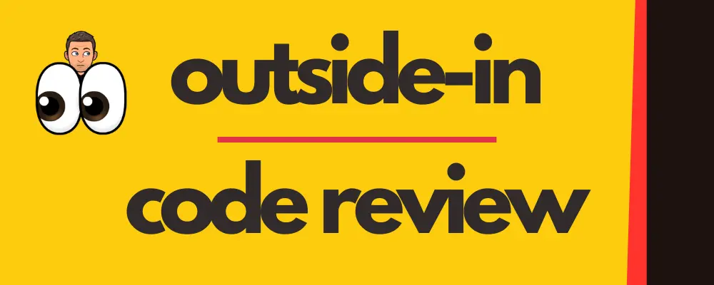

# Outside-In Code Review
[](https://github.com/ythirion/outside-in-code-review-skill/actions/workflows/release.yml)
[](https://github.com/ythirion/outside-in-code-review-skill/releases)

A structured skill for AI agents to explore and review unknown codebases — layer by layer, from surface artifacts down to implementation detail.

> "We spend up to 60% of our time reading code... yet treat this as a side effect rather than a skill to cultivate."



## What is Outside-In Code Review?

Outside-In Code Review is a systematic methodology for understanding unfamiliar codebases without getting lost. It starts with what is visible without reading code (docs, git history, CI/CD), then progressively dives into code structure, quality, and behavior.

Applied with AI, it becomes a rapid discovery process: an agent can reverse-engineer a product backlog, generate architecture diagrams, and rate code quality — all from a cold start, in ~1 hour.

## Articles

This skill is based on my two articles:
- [Outside-In Discovery: A Structured Approach to Unknown Codebases](https://goatreview.com/outside-approach-discover-unknown-codebases/)
- [Augmented Outside-In Discovery with Claude Code](https://goatreview.com/augmented-outside-discovery-claude-code/)

## Repository Structure

```
outside-in-code-review/
├── .claude-plugin/
│   └── plugin.json              # Plugin manifest (claudepluginhub.com)
├── commands/                    # Slash commands installed by the plugin
│   ├── gather_product_insights.md
│   ├── explain_the_architecture.md
│   ├── detail_flow.md
│   └── rate_code_quality.md
├── skills/
│   └── outside-in-code-review/
│       ├── SKILL.md             # Skill definition: frontmatter metadata + execution protocol
│       └── references/
│           └── catalog.md       # All 28 code smells — definitions and refactoring guidance
├── examples/
│   ├── Report.md                # Sample Report.md for a fictional codebase
│   └── details/                 # Sample detail files (Backlog, C4, CodeQuality)
├── scripts/
│   └── package.sh               # Builds outside-in-code-review-<version>.zip
├── README.md                    # This file
├── METHODOLOGY.md               # The 10-step outside-in framework
├── checklist.md                 # Quick reference checklist
├── LICENSE
└── .github/
    └── workflows/
        └── release.yml          # Packages .skill and creates draft release on version tag
```

## Installation

### Option 1 — Claude Plugin Hub (recommended)

Install directly via the [Claude Plugin Hub](https://www.claudepluginhub.com/plugins/ythirion-outside-in-code-review):

```
outside-in-code-review
```

The plugin installs the skill and all slash commands automatically. From any Claude Code session, just describe what you want:

> *"Review this codebase"* / *"Technical audit"* / *"Help me understand this repo"*

### Option 2 — AI agent skill (manual)

Download the latest zip from the [Releases](../../releases) page, unzip, and install:

```bash
mkdir -p ~/.claude/skills/outside-in-code-review
cp -r skill/* ~/.claude/skills/outside-in-code-review/
```

### Option 3 — Individual slash commands

```bash
cp commands/* ~/.claude/commands/
```

### Option 4 — From source

```bash
bash scripts/package.sh
# produces outside-in-code-review-<version>.zip

unzip outside-in-code-review-*.zip

# Install as a skill
mkdir -p ~/.claude/skills/outside-in-code-review
cp -r skill/* ~/.claude/skills/outside-in-code-review/
```

> Claude Code loads skills from `~/.claude/skills/` and commands from `~/.claude/commands/` (global) or `.claude/commands/` (project-level).

## Release a new version

1. Bump the `version` field in `skills/outside-in-code-review/SKILL.md` (and in `.claude-plugin/plugin.json`)
2. Commit and push
3. Tag the commit with the matching version:

```bash
git tag v1.1.0
git push origin v1.1.0
```

The GitHub Action (`.github/workflows/release.yml`) will:
- Package `outside-in-review.skill` from source
- Validate that the tag matches the version in `SKILL.md`
- Create a **draft release** on GitHub with the `.skill` file attached

The Claude Plugin Hub auto-discovers the update within 2 hours once the tag is pushed.

Open the draft on GitHub, review the release notes, and publish when ready.

## Usage

### Running a full discovery session

Once the skill is installed, just describe what you want in any Claude Code session:

> *"Review this codebase"* / *"Technical audit"* / *"I don't know this codebase"*

The skill runs all four phases automatically and produces `outside-in-review/Report.md` + `outside-in-review/details/{Backlog,C4,CodeQuality}.md`.

### Running individual steps

```bash
# Generate C4 architecture diagrams only
/explain_the_architecture

# Rate code quality with smell detection
/rate_code_quality

# Trace a specific feature flow
/detail_flow User Login
```

## Sample Output

See [`examples/Report.md`](./examples/Report.md) for a complete example of what the discovery report looks like.

## Core Principles

- **Outside before inside** — surface artifacts reveal as much as code
- **AI as cognitive reducer** — let the agent build the first mental model
- **Human validation is mandatory** — all AI outputs must be verified with stakeholders

## More explanations
I have explained the concepts behind this approach during a talk at [Mendercon 2026](https://mendercon.com/):
[](https://canva.link/4b9mxwe0oxw67js)
