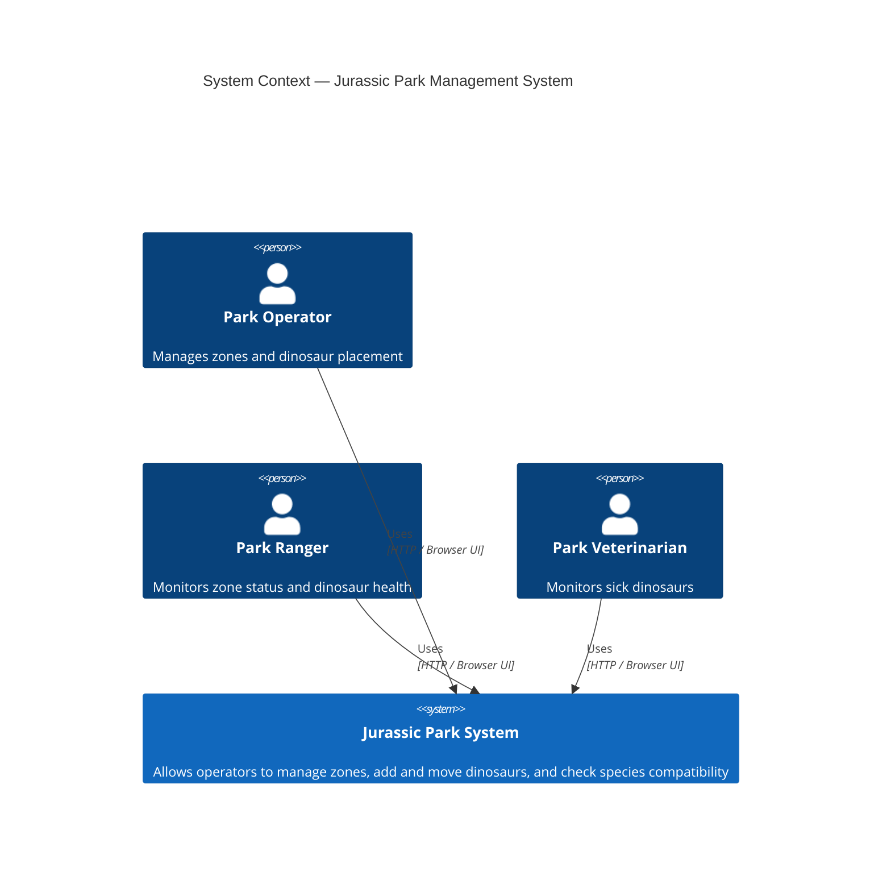
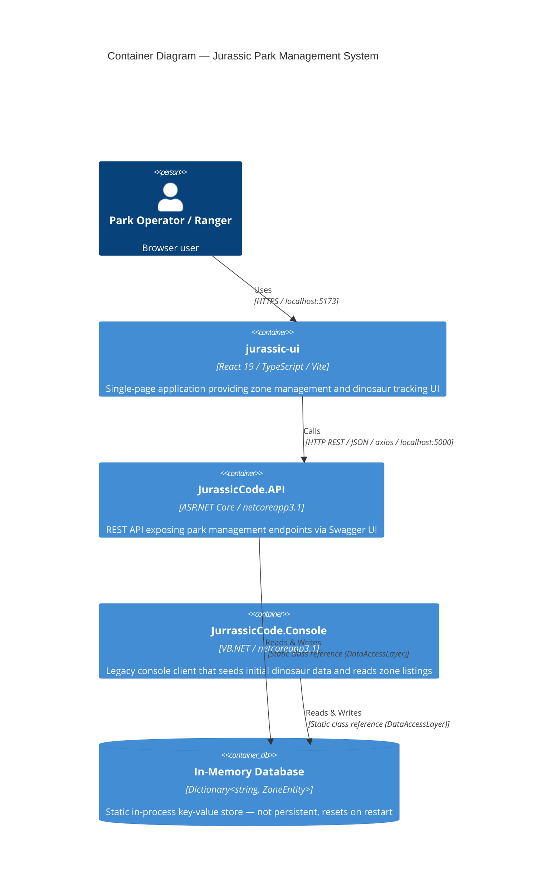
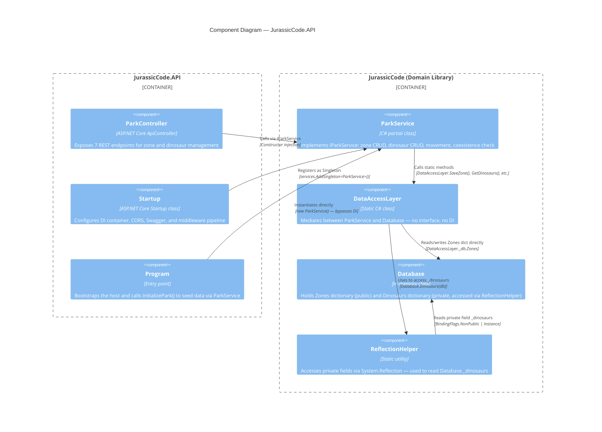
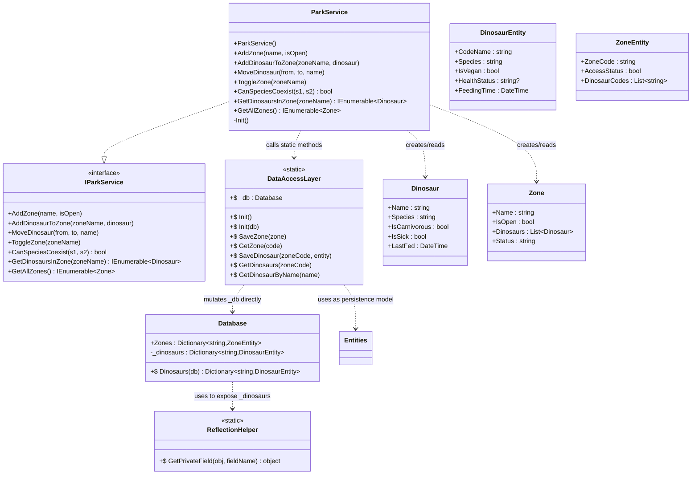

# 🏗️ Architecture — jurassic-code
> ⚠️ AI-inferred from code — validate with the team before sharing externally

← [Back to Report](../Report.md)

---

## Level 1 — System Context

---

## Level 2 — Container

---

## Level 3 — Component (JurassicCode.API)

---

## Level 4 — Code (ParkService — key structural issues)

> **Key structural problem:** `Database` deliberately makes `_dinosaurs` private, then immediately undermines encapsulation by calling `ReflectionHelper.GetPrivateField()` on itself. This is the core anti-pattern: the class actively breaks its own contract.
